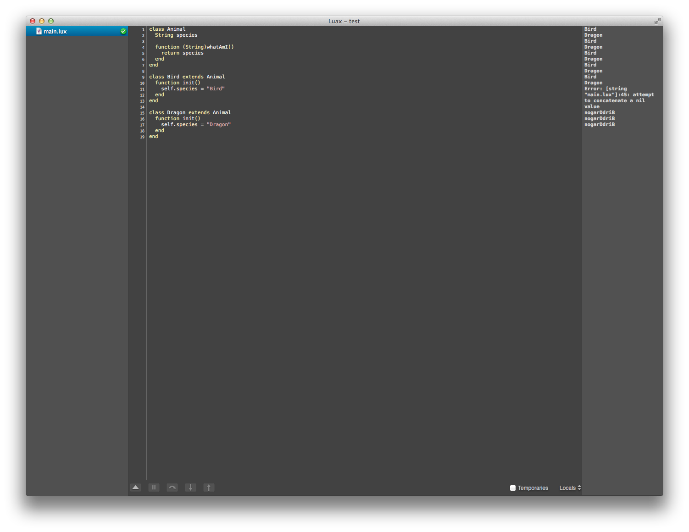
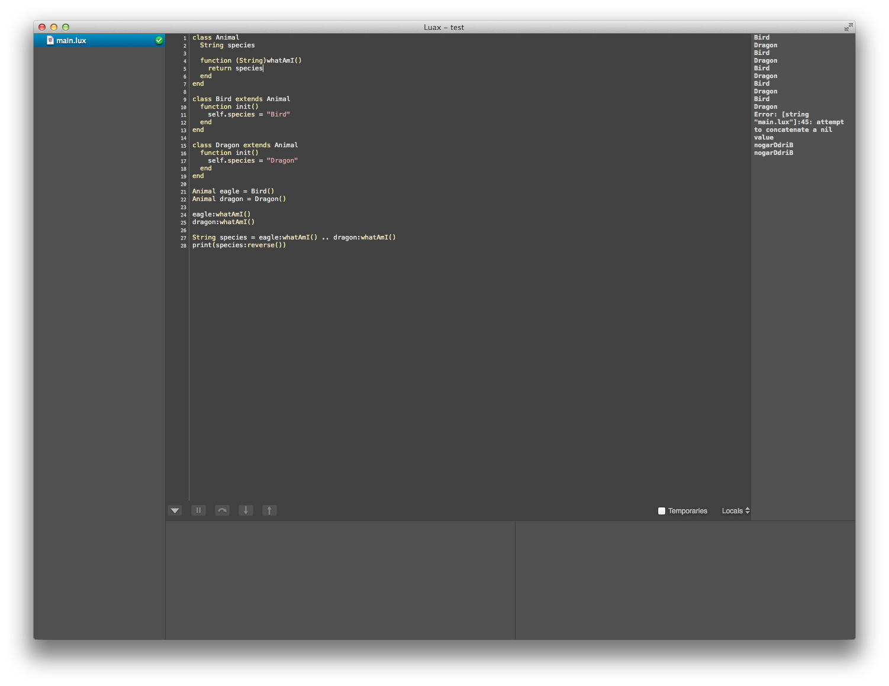
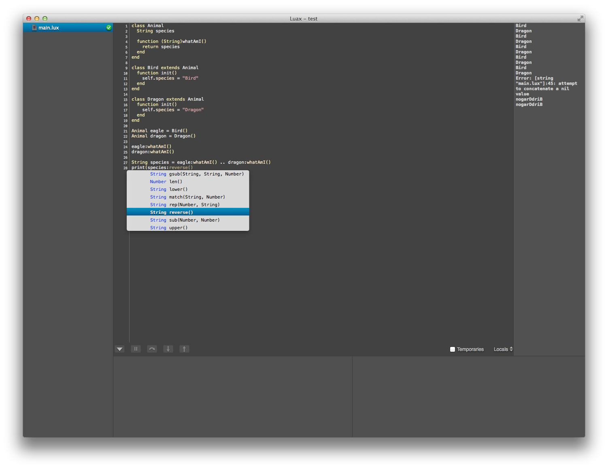
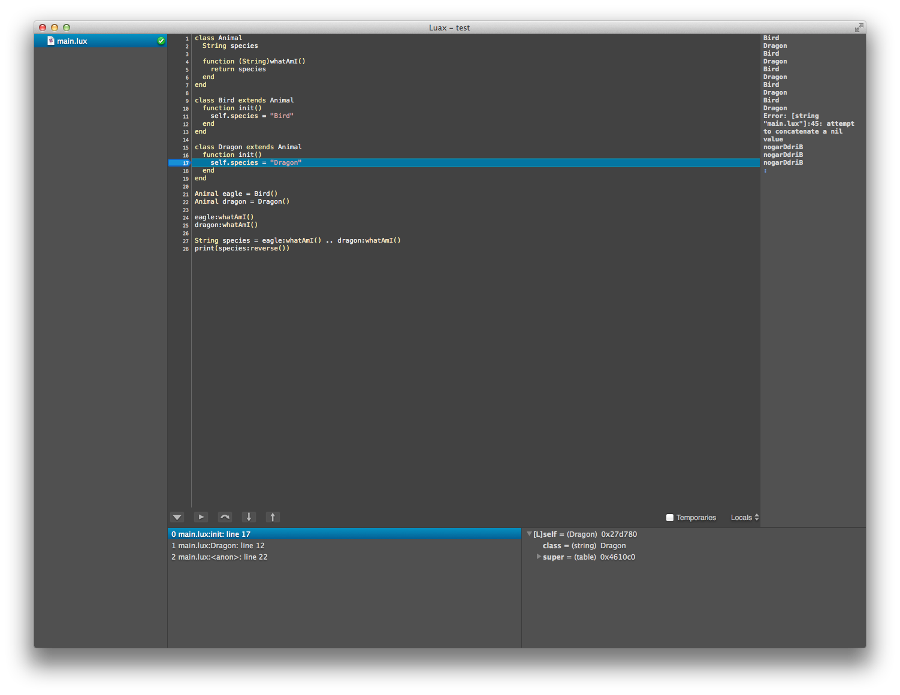

Luax
====

What's Luax?
------------

* Strong typing
* Classes
* Variables are local by default
* Assignment operators ('+=', '-=', etc.)
* IDE + project management
* Compiles to Lua 5.2
* ... 

Motivation
----------

Luax began as a Lua debugger for a game I had been writing. I chose Lua because it is incredibly simple, fast and proven with an active community, but as time went on, I started to get annoyed with how my scripts were working and I didn't feel like this was the best workflow for me. I knew I wanted more readable code and to rid myself of a few annoying quirks of Lua (no assignment ops, global variable bugs, etc.), but I didn't want to lose the incredible power and support of Lua (and [LuaJIT](http://luajit.org)). So, taking some inspiration from other cross-compiled languages ([CoffeeScript](http://coffeescript.org), [LiveScript](http://livescript.net), etc.) I created Luax, a *new* language co-developed with it's own IDE for fast, fun development.

Example
-------

```
class Bird
  String species = "Bird"
  
  function whatAmI()
    print(species)
  end
  
  function fly()
    print("WOOOOSH")
  end
end

Bird eagle = Bird()
eagle:fly()
```

produces:

```Lua
Bird = Bird or setmetatable({}, ...)

function Bird:whatAmI()
  print(self.species)
end
  
function Bird:fly()
  print("WOOOOOSH")
end

local eagle = Bird()
eagle:fly()
```

IDE
===



Autocomplete
------------

Luax variables are strongly typed which allows for the IDE to display context aware autocomplete results.

Integrated Debugger
-------------------

Luax compiles to Lua along with a [source map](https://github.com/mozilla/source-map) that allows for seamless debugging of Luax code using the Lua debug library. The integrated debugger supports breakpoints, stack traversal, local, global and temporary variable inspection, and variable editing using Lua expressions. 

The Complete Syntax of Luax
===========================
<pre>
chunk ::= block

block ::= {stat} [retstat]

stat ::= '<b>;</b>' |
         varlist assignmentop explist | 
         functioncall | 
         label |
         <b>break</b> |
         <b>goto</b> Name |
         <b>do</b> block <b>end</b> | 
         <b>while</b> exp <b>do</b> block <b>end</b> | 
         <b>repeat</b> block <b>until</b> exp | 
         <b>if</b> exp <b>then</b> block {<b>elseif</b> exp <b>then</b> block} [<b>else</b> block] <b>end</b> | 
         <b>for</b> type Name '<b>=</b>' exp '<b>,</b>' exp ['<b>,</b>' exp] <b>do</b> block <b>end</b> | 
         <b>for</b> typednamelist <b>in</b> explist <b>do</b> block <b>end</b> | 
         <b>class</b> Name [extends Name] classbody |
         <b>function</b> ['<b>(</b>'parlist'<b>)</b>'] funcname funcbody | 
         scope <b>function</b> ['<b>(</b>'parlist'<b>)</b>'] Name funcbody | 
         [scope] type namelist ['<b>=</b>' explist] 

retstat ::= <b>return</b> [explist] ['<b>;</b>']

label ::= '<b>::</b>' Name '<b>::</b>'

funcname ::= Name {'<b>.</b>' Name} ['<b>:</b>' Name]

varlist ::= var {'<b>,</b>' var}

var ::= Name | prefixexp '<b>[</b>' exp '<b>]</b>' | prefixexp '<b>.</b>' Name 

scope ::= <b>local</b> | <b>global</b>

type ::= <b>var</b> | <b>Number</b> | <b>Bool</b> | <b>String</b> | <b>Table</b> | <b>Function</b> | Name

namelist ::= Name {'<b>,</b>' Name}

typednamelist ::= type Name {'<b>,</b>' type Name}

explist ::= {exp '<b>,</b>'} exp

exp ::= <b>nil</b> | <b>false</b> | <b>true</b> | Number | String | '<b>...</b>' | function | 
        prefixexp | tableconstructor | exp binop exp | unop exp 

prefixexp ::= var | functioncall | '<b>(</b>' exp '<b>)</b>'

functioncall ::= prefixexp args | prefixexp '<b>:</b>' Name args 

args ::= '<b>(</b>' [explist] '<b>)</b>' | tableconstructor | String 

classbody ::= {classstat} <b>end</b>

classstat ::= <b>function</b> ['<b>(</b>'parlist'<b>)</b>'] Name funcbody | type namelist ['<b>=</b>' explist]

function ::= <b>function</b> funcbody

funcbody ::= '<b>(</b>' [parlist] '<b>)</b>' block <b>end</b>

parlist ::= typednamelist ['<b>,</b>' '<b>...</b>'] | '<b>...</b>'

tableconstructor ::= '<b>{</b>' [fieldlist] '<b>}</b>'

fieldlist ::= field {fieldsep field} [fieldsep]

field ::= '<b>[</b>' exp '<b>]</b>' '<b>=</b>' exp | type Name '<b>=</b>' exp | exp

fieldsep ::= '<b>,</b>' | '<b>;</b>'

assignmentop ::= '<b>=</b>' | '<b>+=</b>' | '<b>-=</b>' | '<b>*=</b>' | '<b>/=</b>' | 
                 '<b>^=</b>' | '<b>%=</b>' | '<b>..=</b>'

binop ::= '<b>+</b>' | '<b>-</b>' | '<b>*</b>' | '<b>/</b>' | '<b>^</b>' | '<b>%</b>' | '<b>..</b>' | 
          '<b>&lt;</b>' | '<b>&lt;=</b>' | '<b>></b>' | '<b>>=</b>' | '<b>==</b>' | '<b>~=</b>' | 
          <b>and</b> | <b>or</b>

unop ::= '<b>-</b>' | <b>not</b> | '<b>#</b>'
</pre>

Links
-----
* [Lua](http://www.lua.org)
* [LuaJIT](http://luajit.org)
* [EBNF](docs/EBNF.md)
* [Source Map](https://github.com/mozilla/source-map)
